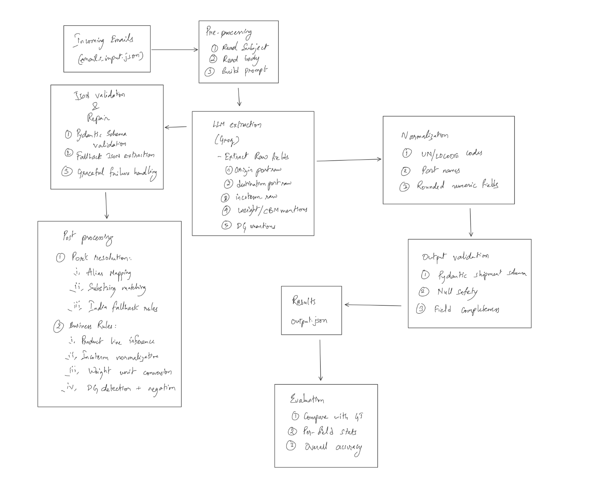

# Lemex-Email-extractor (LLM-Powered Freight Email Extraction)

## Overview

This project implements an LLM-powered email extraction system for freight forwarding pricing enquiries. The objective is to extract structured shipment information from unstructured emails and evaluate accuracy against a provided ground truth dataset.

The final solution combines **LLM-based raw extraction** with **deterministic post-processing logic** to handle domain-specific noise (especially port names and abbreviations).

**Final overall accuracy on provided dataset:** **91.43%**

## Setup Instructions

```bash
pip install -r requirements.txt
python src/extract.py      # Generates output.json
python src/evaluate.py     # Prints accuracy metrics
```
## Approach Summary

The solution follows a extraction approach that combines an LLM for signal extraction with deterministic post-processing for precision. The LLM is deliberately constrained to extract raw, unnormalized facts such as port mentions, incoterms, quantities, and dangerous goods indicators. This minimizes hallucinations and keeps the model’s role focused on language understanding rather than business logic.

All domain-specific rules such as UN/LOCODE resolution, product line inference, unit conversions, incoterm defaults, and dangerous goods negation are implemented deterministically. A dedicated port resolution layer handles abbreviations, aliases, and noisy port mentions using cannonical mappings and fallback rules. This separation of concerns proved handful in improving accuracy, especially for ports.

The system performs schema validation using Pydantic and includes fallback handling for malformed LLM outputs. This design ensures reproducible results, clear failure modes, and strong generalization to all kinds of emails.



## Prompt Evolution
### v1-Basic Extraction
#### Accuracy 28%

Description:
Initial prompt asking the LLM to extract structured fields directly.

Issues observed:
1. Port codes often missing or incorrect

2. LLM returned raw port names instead of UN/LOCODEs

3. Product line accuracy extremely low

Example failures:

```EMAIL_004: destination extracted as "Chennai" instead of INMAA```

```EMAIL_012: "SHA" not recognized as Shanghai```

### v2 – Explicit Business Rules

#### Accuracy: ~61%

Changes:

1. Added explicit business rules to the prompt

2. Listed valid incoterms

3. Clarified India import/export logic

Remaining issues:

1. Port abbreviations ```(SHA, MAA, SIN)``` still failed

2. Multi-word ports like "Xingang / Tianjin" inconsistent

3. Product line failures due to unresolved ports

Example:
```EMAIL_017: origin extracted as "SHA" but failed downstream resolution```

### v3 – Shift Logic Out of the Prompt

#### Accuracy: 91.43%

Key realization:
Prompt tuning alone cannot reliably normalize real-world port mentions.

Changes:

1. Simplified prompt to extract raw facts only

2. Moved normalization into deterministic Python logic

Implemented a robust PortResolver:

1. Alias mapping (SHA → CNSHA, MAA → INMAA)

2. Substring matching

3. India fallback rules

4. Canonicalized port names using port_codes_reference.json

This shift eliminated most remaining errors and generalized well to unseen data.


Final results from ```evaluate.py```:
```bash
OVERALL ACCURACY: 91.43%

product_line             : 88%
origin_port_code         : 86%
destination_port_code    : 96%
incoterm                 : 96%
cargo_weight_kg          : 82%
cargo_cbm                : 92%
is_dangerous             : 100%
```

## Edge Cases Handled
Edge Cases Handled
1. Port Abbreviations and Aliases
Emails: ```EMAIL_012, EMAIL_017, EMAIL_031```

Issue:
Ports mentioned as ```SHA, MAA, SIN, HKG```

Solution:
Used Alias dictionary + substring matching in PortResolver.

2. Multiple Ports / Transshipment Noise

Emails: ```EMAIL_009, EMAIL_022```

Issue:
Emails mentioned multiple ports including transit points.

Solution:
Extract only the first ```origin to destination pair``` and ignore intermediate ports.

3. Dangerous Goods Negation

Emails: ```EMAIL_025, EMAIL_039```

Issue:
Phrases like "non-hazardous" incorrectly flagged as dangerous goods.

Solution:
Explicit negation detection overrides keyword matches.

## System Design Questions
### Scaling to 10,000 emails/day

A queue-based architecture would be used:

1. Move all the Email ingestion into a message queue (e.g., SQS / Kafka)
  
2. Creating a Worker pool for LLM calls with rate limiting

3. Deterministic post-processing kept local and inexpensive

We can store the results stored in a database for auditing and reprocessing. Moreover, caching the LLM responses and avoiding duplicate processing keeps costs within budget.

### Monitoring
 1. Continuously sample processed emails and track per-field accuracy metrics over time  
 2. Compare model outputs against delayed human-labeled ground truth
    Incase the accuracy drop then, first step is to identify which specific fields regressed (e.g., ports vs incoterms). The raw LLM outputs are then inspected separately from deterministic post-processing to isolate whether the failure is model-driven or rule-driven. Based on this analysis, either prompt adjustments or rule updates are applied and validated through regression testing.

### Multilingual
1. We can detect the email language upfront and route non-English emails to a multilingual instruction-tuned model something like **Llama 4 Scout**)
2. Keep downstream normalization and business logic unchanged to preserve accuracy  

For multilingual emails, a multilingual Llama model is used to extract raw signals such as ports, incoterms, and quantities across languages. 
The model is expected to normalize localized port mentions into English before deterministic resolution. Accuracy evaluation remains consistent by comparing structured outputs rather than raw text.
